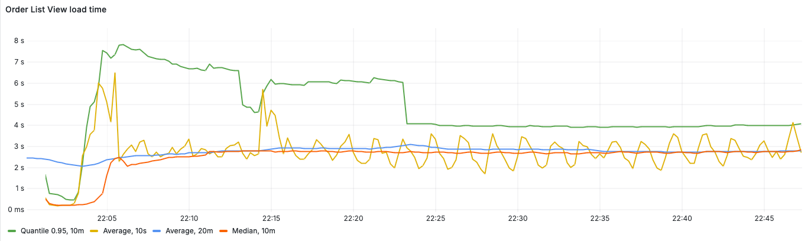

# Performance testing

## Environment

### Bookstore adjustments

It makes sense to mention a few changes that have been applied to the project in order to make performance testing
possible.

#### 1. Actuator + Prometheus micrometer registry

Next libraries have been added to expose prometheus actuator endpoint at `/actuator/prometheus`:

 ```groovy
    // Monitoring
implementation 'io.micrometer:micrometer-registry-prometheus'
implementation 'org.springframework.boot:spring-boot-starter-actuator'
   ``` 

The rest of endpoint set up and other minor changes can be seen
in [this commit](https://github.com/jmix-framework/jmix-bookstore-2/commit/a87d987d9eb458b8b2a6c9c3dc49868a3abb134e).

[//]: # (todo link to commit)

#### 2. Disable Vaadin checks:

See [application.properties](../src/main/resources/application.properties):

```properties
# Jmeter tests support
vaadin.disable-xsrf-protection=true
vaadin.syncIdCheck=false
```

[//]: # (todo: formulations?)

#### 3. Task notification timer has been disabled to simplify jmeter http request recording and emulation

### Instruments

List of additional software used in Bookstore application performance tests:

- [PostgreSQL](https://www.postgresql.org/) database.
- [Node exporter](https://github.com/prometheus/node_exporter) to expose server metrics such as CPU loading.
- [Jmeter](https://jmeter.apache.org/) with [Prometheus Listener](https://github.com/johrstrom/jmeter-prometheus-plugin)
  to generate test load and provide client-side metrics.
- [Prometheus](https://prometheus.io/) to collect and store results.
- [Grafana](https://grafana.com/) for visualisation.

### Infrastructure

There are two servers and one metrics machine.

* **Application server** contains application that run as a boot jar and node exporter.
* **Database server** contains PostgreSQL database and Jmeter
* **Metrics machine** contains Prometheus and Grafana

[//]: # (TODO Servers diagram)

### Server configuration

[//]: # (TODO Hardware configuration)

## Test scenario

### Goals

Determine Jmix application resources consumption when significant (1000) amount of users are active.

[//]: # (TODO: Additional goal: resoruces consumption dependency on users count and intensity of usage)

[//]: # (TODO: More precise definition of goals, rephrase? Are 1000 users "significant?")

### Implementation

Recording and playing http requests using JMeter has been selected in order to create required load without usage
of many resources for web clients.
Unfortunately pure JMeter http requests cannot fully emulate Vaadin client on complex scenarios which leads to up to 50%
of errors for 1000 users working at the same time.
Thus, the simplest scenario has been chosen which can reliably work without errors.

[Test plan](jmeter/OrderCreation.jmx) has been created according to
this [instruction](https://vaadin.com/blog/performance-testing-a-vaadin-application-part-3-apache-jmeter)
with several additions and modifications.


[//]: # (todo: Are complete scenario creation instructions needed?)

The test plan represents the infinite loop of the following user actions:

1. Load login page
2. Wait an average of `loginWait` milliseconds
3. Fill credentials (hikari/hikari) and log in
4. Open Order List View
5. Click on "Create" button to open Order Details View with new Order entity
6. Select a customer (one of first 10 customers in list depending on thread number)
7. Create 3 order lines by doing next actions:
    1. Click on "Create" button in Order Lines block
    2. Select a product
    3. Click "OK" button
8. Confirm order creation by the click on "OK" button
9. Wait an average of `logoutWaitAvg` milliseconds
10. Log out

In order to emulate user actions realistically, there is an average of `clickPeriodAvg` milliseconds of waiting time
between each user click action and the previous request.  
Login and logout are required for each loop because of limitations of http request emulation approach.
Logging in is a heavy operation and needs to be balanced by idle time (`loginWait`,`logoutWait`) to make the test more
similar to normal user actions.

[//]: # (TODO: list of all test plan paramters and usage instructions)

## Metrics

The following metrics are considered:

- **View loading time** has been measured by http response time for all queries involved in view loading and
  initialization.
  `JMeter Prometheus listener` (see the  [test plan](jmeter/OrderCreation.jmx)) provides metrics. The following queries
  are related to the next actions:
    - Open List view: `LoadOrdersListView-34`, `OrderCreation-37`, `OrderCreation-38`
    - Open Detail view: `CLICK-create-new-order-39`, `OrderCreation-40`, `OrderCreation-41`
    - Save entity and return to the list view: `CLICK-save-order-70`, `OrderCreation-71`, `OrderCreation-72`
- **Average entity saving time** is measured by micrometer registry timer
  in [OrderDetailView.java#saveDelegate](../src/main/java/io/jmix/bookstore/view/order/OrderDetailView.java)
- **CPU usage** metric is provided by node exporter on app server.
- **Average heap usage** metric is provided by micrometer registry.
- **Allocated heap memory** is set by -Xmx key on app start.

## Running and measurement

### Environment setting up

**Node exporter** is installed on the application
server [via tarball](https://prometheus.io/docs/guides/node-exporter/).

**PostgreSQL 16.3** is deployed with docker from the [official image](https://hub.docker.com/_/postgres) on the database
server.

**JMeter 5.6.3** is placed to the database server.
**Prometheus** is deployed with docker to the metrics machine using [this config](prometheus/prometheus_perftests.yml).
**Grafana 11.1.4** is deployed with docker to the metrics machine according to
the [official docs](https://grafana.com/grafana/download?platform=docker).

### Application building and running

The **application** is build from "performance_tests" branch by `./gradlew build -Pvaadin.productionMode=true bootJar`
command.

Then output jar is copied to the application server and run by command:

```shell
java -jar -Dspring.profiles.active=perfTests -Xmx<N> jmix-bookstore_prod6.jar
```

where `<N>` in [2g,5g,10g,14g].

### Test running

The [test plan](jmeter/OrderCreation.jmx) have been run on db server with command:

```shell
./jmeter -n -t path/to/OrderCreation.jmx  -l logs/log.txt -JthreadCount=1000 -Jhost=<app_server_ip> -JrampUpPeriod=230
```

### Measurements

Let's look at the visualisation the results for test with 5Gb of heap size 1000 users acting
according to the described [test plan](#implementation) with default parameters and `rampUpPeriod=230` seconds.

#### Memory

Memory usage can be visualised by metric `jvm_memory_used_bytes` and looks like:


#### CPU usage

CPU usage is measured by `node_cpu_seconds` metric by summing all `mode`s except "idle":


As we can see, all 8 cores of the processor are almost fully used (90%). The same distribution is observed for all other
tests
for 1000 users with default test plan parameters and different allocated memory volumes.

#### View loading time

Average view loading time can be measured by calculating rate of `jmeter_rt_summary_sum` metric and summarise results
for each query involved in particular view loading:

```
rate(jmeter_rt_summary_sum{label="LoadOrdersListView-34"}[10s]) / rate(jmeter_rt_summary_count{label="LoadOrdersListView-34"}[10s])
```

and then summarised using grafana expression.

Median value can be obtained by selecting 0.5 quantile of the metric:

```
sum(jmeter_rt_summary{label=~"LoadOrdersListView-34|OrderCreation-37|OrderCreation-38", quantile="0.5"})
```

For Order List View load time will look next way:


As we can see, there is an initial increase in load at the beginning of the test, which later stabilizes after a few
minutes.
Therefore, we will exclude the first 10 minutes from our analysis and focus on the average resource consumption during
one of the subsequent periods when the value remains relatively constant.
This typically occurs around the 40-minute mark of the load test.

For OrderListView the average load time will be 2.8s (for 1000 users and 5Gb of heap size).

#### Entity saving time

Order Details DataContext saving time can be observed using `jmix_bookstore_order_save_time_seconds` metric:

Average entity saving time is relatively small (0.015s) when compared to view loading time.

## Results

Tests have been run for applications with next heap memory sizes: 2 Gb, 5 Gb, 10 Gb, 14 Gb.
For each case 1000 users acted according to the scenario described above with:

* `loginWait` = 10s
* `logoutWaitAvg` = 30s
* `logoutWaitDev` = 10s
* `clickPeriodAvg` = 2s
* `clickPeriodDev` = 1s
* `rampUpPeriod` = 230s

The results of measurments are shown in the table below:

| Allocated heap memory, Gb | Average used heap memory over 30m, Gb(%) | Order list view, s | Order Detail View, s | Save Order and return to list view, s | Order saving time, s | CPU usage, % |
|---------------------------|:----------------------------------------:|:------------------:|:--------------------:|:-------------------------------------:|:--------------------:|:------------:|
| 2                         |                1.74 (87%)                |        7.2         |         3.6          |                  1.5                  |        0.300         |      94      |
| 5                         |                3.4 (68%)                 |        2.8         |         2.5          |                  1.5                  |        0.015         |      90      |
| 10                        |                5.6 (56%)                 |        2.34        |         2.1          |                  1.3                  |        0.014         |      91      |
| 14                        |                                          |                    |                      |                                       |                      |              |

[//]: # (TODO conclusions, maybe another tests with another amount of users/?cores? if possible)

[//]: # (todo rephrase?)

## Restrictions

These results should be considered as a very rough estimate of the Jmix Bookstore application's performance, as they are
based
on the following simplifications:

* All users log in with the same credentials
* All users repeat the same simplest scenario due to Vaadin client emulation issues.
* Image loading has been disabled to simplify the http requests set in the scenario.
* Task notification timer has been disabled for simplicity.


