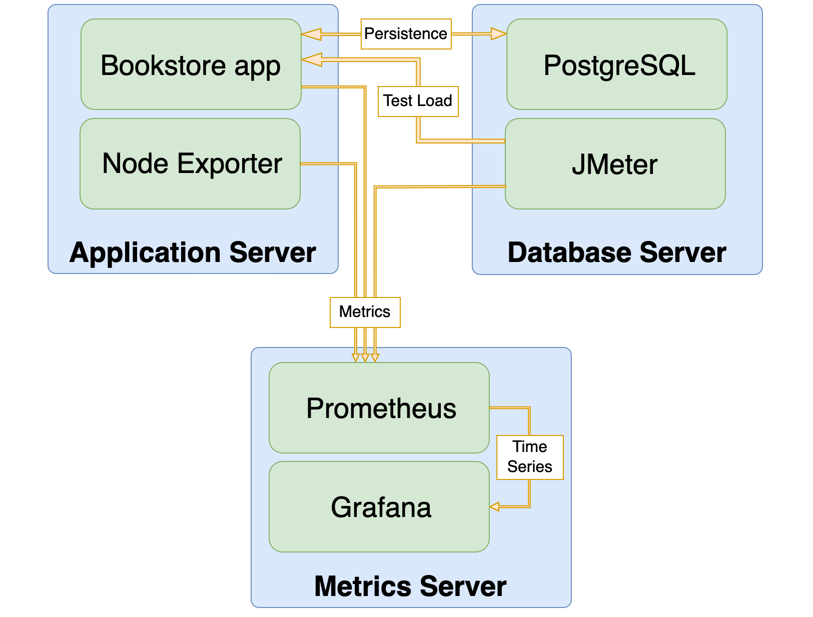

# Performance testing

## Goal

Determine the resource consumption of the Bookstore application when a significant number of users are active.

## Environment

### Bookstore Adjustments

It makes sense to mention changes that have been made to the project to make performance testing possible.

#### 1. Actuator and Prometheus Micrometer Registry

Next libraries have been added to expose prometheus actuator endpoint at `/actuator/prometheus`:

 ```groovy
// Monitoring
implementation 'io.micrometer:micrometer-registry-prometheus'
implementation 'org.springframework.boot:spring-boot-starter-actuator'
   ``` 

The rest of the endpoint set up and other minor changes can be seen in
[this commit](https://github.com/jmix-framework/jmix-bookstore-2/commit/a87d987d9eb458b8b2a6c9c3dc49868a3abb134e).

#### 2. Disable Vaadin Checks:

See [application-perf-tests.properties](../src/main/resources/application-perf-tests.properties):

```properties
# JMeter tests support
vaadin.disable-xsrf-protection=true
vaadin.syncIdCheck=false
```

#### 3. Task Notification Timer

Task Notification Timer has been disabled to simplify JMeter HTTP request recording and emulation.

### Instruments

List of additional software used in Bookstore application performance tests:

- [PostgreSQL](https://www.postgresql.org/) database.
- [Node Exporter](https://github.com/prometheus/node_exporter) to expose server metrics such as CPU loading.
- [JMeter](https://jmeter.apache.org/) with [Prometheus Listener](https://github.com/johrstrom/jmeter-prometheus-plugin)
  to generate test load and provide client-side metrics.
- [Prometheus](https://prometheus.io/) to collect and store results.
- [Grafana](https://grafana.com/) for visualisation.

### Infrastructure

There are three servers: two for running tests and one for collecting metrics:

* **Application Server** contains the Bookstore application, which is run as a boot jar, and a Node Exporter.
* **Database Server** contains a PostgreSQL database and a JMeter application. This server stores persistent data and
  creates
  a test load.
* **Metrics Server** includes Prometheus and Grafana applications. Collects and processes metrics.



### Server Configuration

Application and Database Servers are virtual machines with next characteristics each:

* **Virtualization:** Proxmox VE, qemu-kvm
* **CPU**: 8 cores, x86-64-v3
* **RAM**: 16 Gb
* **HDD**: 200 Gb
* **OS**: Ubuntu 22.04

Host Hardware:

* **CPU**: Intel Xeon E5 2686 v4 2.3-3.0 GHz
* **RAM**: DDR4 ECC 2400 MHz
* **HDD**: ZFS, Raid1 2-х Sata Enterprise SSD SAMSUNG MZ7L33T8HBLT-00A07

## Test

### Method

The [JMeter HTTP(S) Test Script Recorder](https://jmeter.apache.org/usermanual/jmeter_proxy_step_by_step.html)
was used to create the required amount of load without using many resources on web clients.
This approach allows a sequence of HTTP requests to be recorded and then replayed in a large number of threads
simultaneously using a small amount of resources. However, it is not possible to react to changes in real-time as
a full-fledged Vaadin client can. Therefore, the simplest testing scenario was chosen in order to avoid errors
and incorrect requests.

[Test plan](jmeter/OrderCreation.jmx) has been created according to
this [instruction](https://vaadin.com/blog/performance-testing-a-vaadin-application-part-3-apache-jmeter)
with several additions and modifications.

### Test Plan

The test plan for each user (thread) represents an infinite loop of the following actions:

1. Load login page
2. Wait an average of `loginWait` milliseconds
3. Fill credentials (hikari/hikari) and log in
4. Open Order List View
5. Click on "Create" button to open Order Details View with new Order entity
6. Select a customer (one of the first 10 customers in the list, depending on thread number)
7. Create 3 order lines by doing next actions:
    1. Click on "Create" button in Order Lines block
    2. Select a product
    3. Click "OK" button
8. Confirm order creation by the click on "OK" button
9. Wait an average of `logoutWaitAvg` milliseconds
10. Log out

In order to emulate user actions realistically, there is an average `clickPeriodAvg` millisecond waiting time between
each user click and the previous request.
Login and logout are required for each loop due to the limitations of the HTTP request approach. Logging in is a heavy
operation and needs to be balanced with idle time (`loginWait`,`logoutWait`) to make the test more similar to normal
user actions.

#### Test Plan Parameters

Test plan parameters can be specified using `-J<parameterName>` command-line arguments during the test run.
E.g.: `-JthreadCound=500`. The next parameters are available:

| Parameter name | Default Value |                          Description                          |
|:--------------:|:-------------:|:-------------------------------------------------------------:|
|      host      |   localhost   |                      Bookstore app host                       |
|      port      |     8080      |                      Bookstore app port                       |
|     scheme     |     http      |                     Bookstore app scheme                      |
|  threadCount   |     1000      | The number of users performing the test steps simultaneously. |
|  rampUpPeriod  |      60       | How long to take to "ramp-up" to the full number of users, s. |
| clickPeriodAvg |     2000      |              Average period between clicks, ms.               |
| clickPeriodDev |     1000      |            Click period min and max deviation, ms.            |
|   loginWait    |     10000     |                Time to wait before login, ms.                 |
| logoutWaitAvg  |     30000     |           Average period to wait before logout, ms.           |
| logoutWaitDev  |     10000     |        Before logout period min and max deviation, ms.        |

## Metrics

The following metrics are considered:

- **View loading time** has been measured by HTTP response time for all queries involved in view loading and
  initialization.
  `JMeter Prometheus listener` (see the  [test plan](jmeter/OrderCreation.jmx)) provides these metrics.
  The following queries are related to the next actions:
    - Open List view: `LoadOrdersListView-34`, `OrderCreation-37`, `OrderCreation-38`
    - Open Detail view: `CLICK-create-new-order-39`, `OrderCreation-40`, `OrderCreation-41`
    - Save entity and return to the list view: `CLICK-save-order-70`, `OrderCreation-71`, `OrderCreation-72`
- **Average entity saving time** is measured by micrometer registry timer
  in [OrderDetailView.java#saveDelegate](../src/main/java/io/jmix/bookstore/view/order/OrderDetailView.java)
- **CPU usage** metric is provided by node exporter on app server.
- **Average heap usage** metric is provided by micrometer registry.
- **Allocated heap memory** is set by -Xmx key on app start.

## Running and Measurement

### Environment Setup

**Node Exporter** is installed on the application
server [via tarball](https://prometheus.io/docs/guides/node-exporter/).

**PostgreSQL 16.3** is deployed with docker from the [official image](https://hub.docker.com/_/postgres) on the database
server.

**JMeter 5.6.3** is placed to the database server.

**Prometheus** is deployed with docker to the metrics server using [this config](prometheus/prometheus_perftests.yml).

**Grafana 11.1.4** is deployed with docker to the metrics server according to
the [official docs](https://grafana.com/grafana/download?platform=docker).

### Building and Running the Application

The **application** is build from "performance_tests" branch by `./gradlew build -Pvaadin.productionMode=true bootJar`
command.

Then output jar is copied to the application server and run by command:

```shell
java -jar -Dspring.profiles.active=perf-tests -Xmx<N> jmix-bookstore.jar
```

where `<N>` in [2g,5g,10g,14g].

### Test Running

The [test plan](jmeter/OrderCreation.jmx) have been run on the db server with command:

```shell
./jmeter -n -t path/to/OrderCreation.jmx  -l logs/log.txt -JthreadCount=1000 -Jhost=<app_server_ip> -JrampUpPeriod=230
```

### Measurements

Let's look at the visualisation of the results for test with 5Gb of heap size 1000 users acting
according to the described [test plan](#implementation) with default parameters and `rampUpPeriod=230` seconds.

#### Memory

Memory usage can be visualised by metric `jvm_memory_used_bytes` and looks like:


#### CPU Usage

CPU usage is measured by `node_cpu_seconds` metric by summing all `mode`s except "idle":


As we can see, all 8 cores of the processor are almost fully used (90%). The same distribution is observed for all other
tests
for 1000 users with default test plan parameters and different allocated memory volumes.

#### View Loading Time

Average view loading time can be measured by calculating rate of `jmeter_rt_summary_sum` metric and summarise results
for each query involved in particular view loading:

```
rate(jmeter_rt_summary_sum{label="LoadOrdersListView-34"}[10s]) / rate(jmeter_rt_summary_count{label="LoadOrdersListView-34"}[10s])
```

and then summarised using grafana expression.

Median value can be obtained by selecting 0.5 quantile of the metric:

```
sum(jmeter_rt_summary{label=~"LoadOrdersListView-34|OrderCreation-37|OrderCreation-38", quantile="0.5"})
```

For the Order List View load time will look next way:


As we can see, there is an initial increase in load at the beginning of the test, which later stabilizes after a few
minutes.
Therefore, we will exclude the first 10 minutes from our analysis and focus on the average resource consumption during
one of the subsequent periods when the value remains relatively constant.
This typically occurs around the 40-minute mark of the load test.

For OrderListView the average load time will be 2.8s (for 1000 users and 5Gb of heap size).

#### Entity Saving Time

Order Details DataContext saving time can be observed using `jmix_bookstore_order_save_time_seconds` metric:

Average entity saving time is relatively small (0.015s) when compared to view loading time.

## Results

Tests have been run for applications with next heap memory sizes: 2 Gb, 5 Gb, 10 Gb, 14 Gb.
For each case 1000 users acted according to the scenario described above with:

* `loginWait` = 10s
* `logoutWaitAvg` = 30s
* `logoutWaitDev` = 10s
* `clickPeriodAvg` = 2s
* `clickPeriodDev` = 1s
* `rampUpPeriod` = 230s

The results of measurements are shown in the table below.

| Allocated heap memory, Gb | Average used heap memory, Gb(%) | List view average load time, s | Detail view average load time, s | Save Order and return to list view average time, s | Order saving average time, s | CPU usage, % |
|:-------------------------:|:-------------------------------:|:------------------------------:|:--------------------------------:|:--------------------------------------------------:|:----------------------------:|:------------:|
|             2             |           1.74 (87%)            |              7.2               |               3.6                |                        1.5                         |            0.300             |      94      |
|             5             |            3.4 (68%)            |              2.8               |               2.5                |                        1.5                         |            0.015             |      90      |
|            10             |            5.6 (56%)            |              2.3               |               2.1                |                        1.3                         |            0.014             |      91      |
|            14             |            6.6 (47%)            |              2.2               |               1.9                |                        1.2                         |            0.017             |      89      |

## Restrictions

These tests are based on a number of simplifications and the results should be considered with the following limitations
in mind:

* All users log in with the same credentials
* All users repeat the same simplest scenario in order to avoid necessity of Vaadin clients usage.
* Image loading has been disabled to simplify the HTTP requests set in the scenario.
* Task notification timer has been disabled for simplicity.


